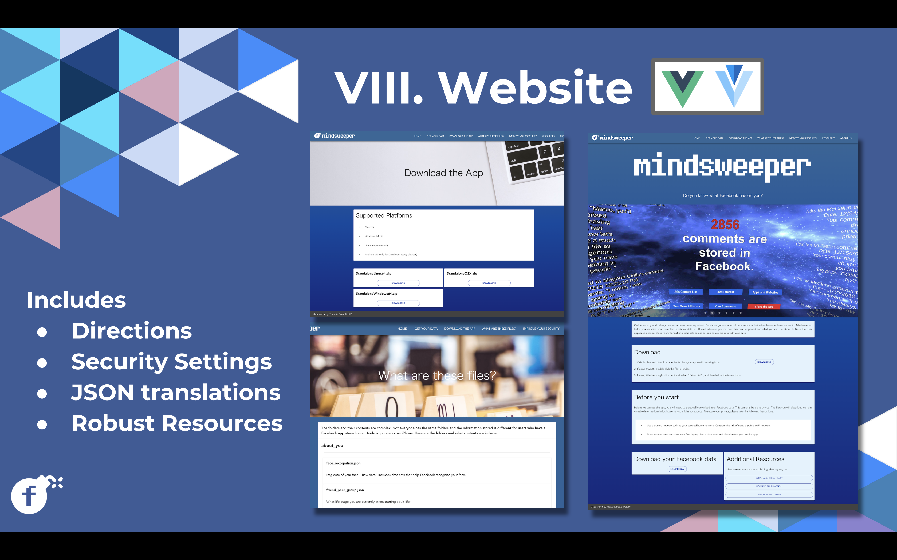
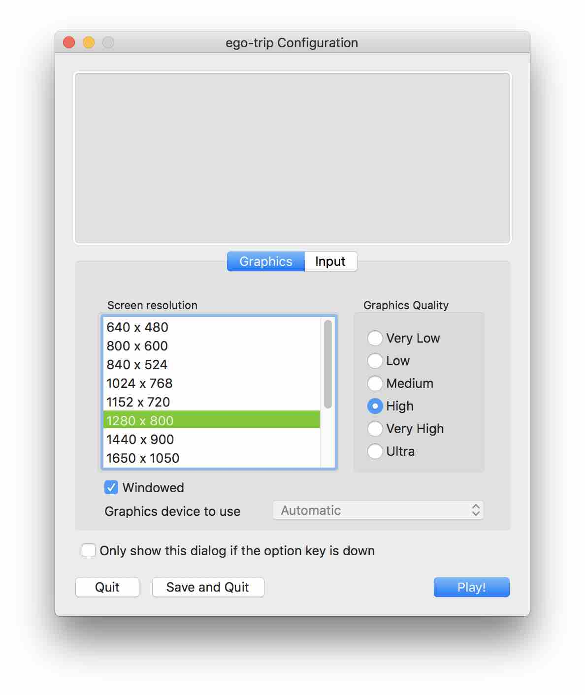
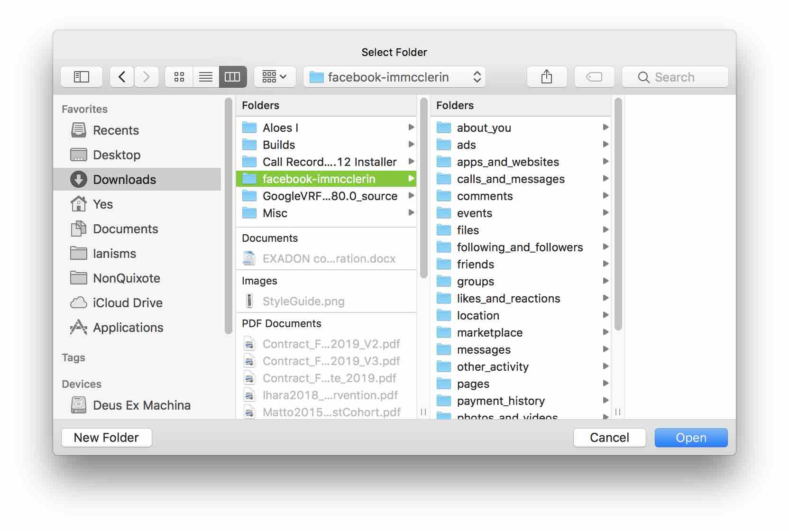

<h1 align="center"> Mindsweeper </h1>  

  

  Do you know what Facebook has on you? 😈

## Table of Contents

- [Introduction](#introduction)
- [Features](#features)
- [Download](#download)
- [Contributors](#contributors)

## Introduction

Online security and privacy has never been more important. Facebook gathers a lot of personal data that advertisers can have access to. Mindsweeper helps you visualize your complex Facebook data in 3D and educates you on how this has happened and what you can do about it. <i>Note that this application cannot store your information and is safe to use as long as you are safe with your data.</i>

<b>This GitHub page stores the source codes for [Mindsweeper's landing page](https://mindsweeper-app.herokuapp.com/).</b>

  

## Features

A few of the things you can do with this app:

 - Upload your file securely and browse your data.
 - The current version allows you to view in 3D the advertisers whom have your information as well as interests Facebook believes you may have.
 

  

## Download

1. Visit <a href="https://mindsweeper-app.herokuapp.com/">our landing page</a> and download the app for the system you will be using it on.
2. If using MacOS, double click the file in Finder.
3. If using Windows, right click on it and select “Extract All” , and then follow the instructions.

## Before you start
Before we can use the app, you will need to personally download your Facebook data. This can only be done by you. The files you will download contain valuable information (including some you might not expect). To secure your privacy, please take the following instructions:

- Use a trusted network such as your secured home network. Consider the risk of using a public WiFi network.
- Make sure to use a virus/malware free laptop. Run a virus scan and clean before you use this app.

Instructions on how to <a href="https://github.com/mortar-pestle/mindsweeper/wiki/Download-your-Facebook-data">download your Facebook data can be found here</a> as well as in your downloaded Mindsweeper folder.

## Opening Mindsweeper
When launching the application file, you may be asked which resolution you would prefer. <b>Make sure you select the "Windowed" button.</b> Select the Play button when you are ready.

_⚠️ **NOTE**: If you are using MaxOS, you might get a warning dialog that says "you cannot open the app downloaded from the unidentified developer. In this case, go to Apple menu > System Preferences, click Security & Privacy, and then click General. You can run the app by clicking "Open the app" at the bottom._

  

After the game boots up, you will see the main menu.

  

Click *Login* and navigate to the folder that holds all of your Facebook Data and click <b>Open</b>.

  

In the dashboard in front of you are buttons to change what data you'll be displaying. Move your mouse to look in your desired direction.

  

## When you finish
It is also important that you clean up information once you used this application. Do not leave the files that contain your personal information on your hard drive. Make sure to do the following:

- Delete the downloaded zip file.
- Delete the folder you extracted it to.
- Empty the trash.
- You do not have to uninstall this application as it does not store any of your personal information it visualizes.

## Additional Resources
Still have questions? How did Facebook get all this information? How can you improve your online privacy? Want to delete your Facebook? 

<b><a href="https://mindsweeper-app.herokuapp.com/">Check out our Website! 💣</a></b>

## Contributors

This project is developed by these awesome contributors:

- [Carlos Castro](https://github.com/zero4994)
- [Ian McClerin](https://github.com/dejaviewdujour)
- [Toshiya Sasaki](https://github.com/toshyss)
- [Yuma Sumi](https://github.com/y-yeah)

[Contribution guidelines]() will be soon uploaded.

---

🎮 <b>LICENSE</b> : CC7 Team Mortar and Pestle 🎮
 This app was made during our time at <a href="https://www.codechrysalis.io/">Code Chrysalis</a>

